# Supplementary Materials

Seven experiments addressing reviewer concerns. Each section provides methodology, quantitative results, and visualizations.

**Model**: DINOv2-B/14 backbone + 8-layer Transformer (95M params). Base model pretrained for 100K steps on 9 synthetic tasks. Sections 1-5 and 7 fine-tune from this checkpoint; Section 6 evaluates it directly against VLMs.

---

## 1. Human Connectomics: H01 Cortex

Real connectomics neuron tracking on the H01 human cortex EM dataset (16 nm/px, 2048x2048 volumes). The pretrained multitask model is fine-tuned on ~6.5M frames from 52,000 episodes derived from 1,013 myelinated axon skeletons. The model must identify a neuron at z=0 and trace it through 50 z-slices by clicking on its cross-section at each slice, using only raw EM images with no segmentation overlay.

### Training & Teacher-Forced Evaluation

| | |
|:---:|:---:|
| 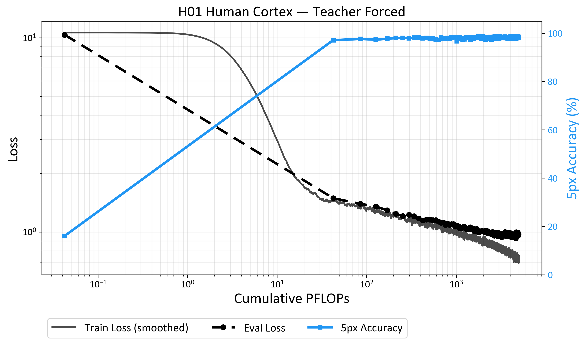 | 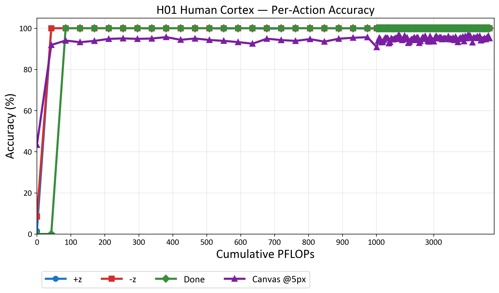 |
| **Figure 1.1.** Training loss and teacher-forced placement accuracy. Overall @5px reaches **98.7%**. Button accuracy hits 100% by step 5K. | **Figure 1.2.** Per-action teacher-forced accuracy. Canvas @5px reaches **96.7%** (step 42K). Action validity reaches 100% by step 2K. |

**Table 1.1.** Teacher-forced evaluation on 28 held-out neurons.

| Metric | Pretrained (step 1) | Best | Final (117K) |
|--------|:-------------------:|:----:|:------------:|
| Overall @5px | 16.1% | **98.7%** | 98.3% |
| Canvas @5px | 43.3% | **96.7%** | 95.2% |
| Button accuracy | 4.7% | **100%** | 100% |
| Action validity | 99.0% | **100%** | 100% |

The pretrained model already achieves 99% action validity and 43% canvas @5px on this unseen real-data task before any fine-tuning.

### Autoregressive Evaluation

| | |
|:---:|:---:|
| 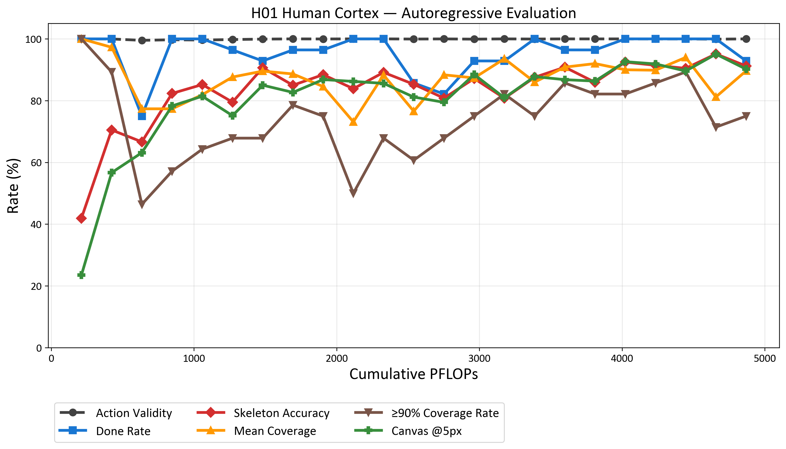 |  |
| **Figure 1.3.** Autoregressive metrics over training. | **Figure 1.4.** Example autoregressive neuron tracking episode on H01 data. |

**Table 1.2.** Autoregressive evaluation on 28 held-out neurons (64 episodes/checkpoint).

| Metric | Best |
|--------|:----:|
| Skeleton accuracy | **95.1%** |
| Canvas @5px | **95.1%** |
| Canvas @10px | **97.5%** |
| Done rate | **100%** |
| Mean coverage | 94.0% |
| First node accuracy | **100%** |

The model correctly traces the target neuron 95% of the time during closed-loop evaluation, completes all tasks, and always identifies the correct starting neuron. Higher performance than C. elegans (Section 2), likely due to myelinated axons being visually more distinct and 2.5x more training data.

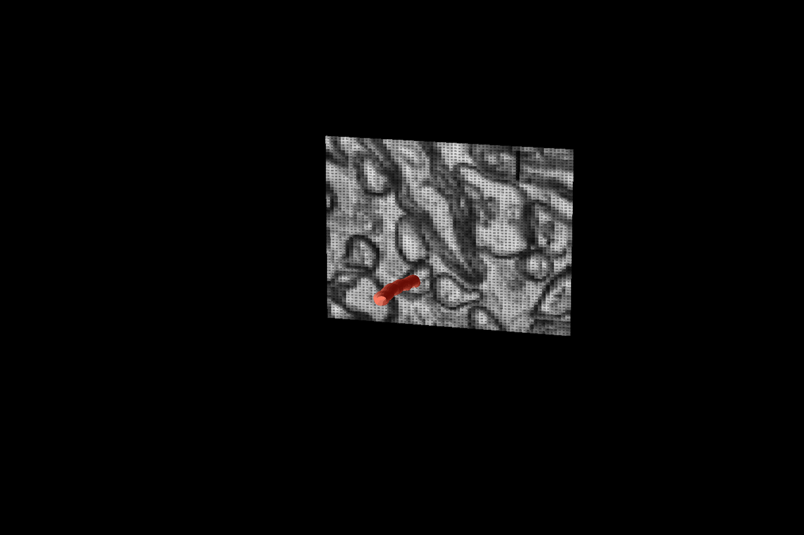

**Figure 1.5.** 3D visualization of a neuron traced by the model in the H01 human cortex dataset.

---

## 2. Worm Connectomics: C. elegans

Real connectomics neuron tracking on the Witvliet 2020 C. elegans nerve ring dataset (8 nm/px). The pretrained multitask model is fine-tuned on ~2.6M frames from 19,872 episodes. This is a particularly challenging domain: C. elegans neuropil is extremely dense, neurites are much smaller than human myelinated axons, and only 30.5% of voxels are segmented (vs. 58.5% for H01).

### Training & Teacher-Forced Evaluation

| | |
|:---:|:---:|
| 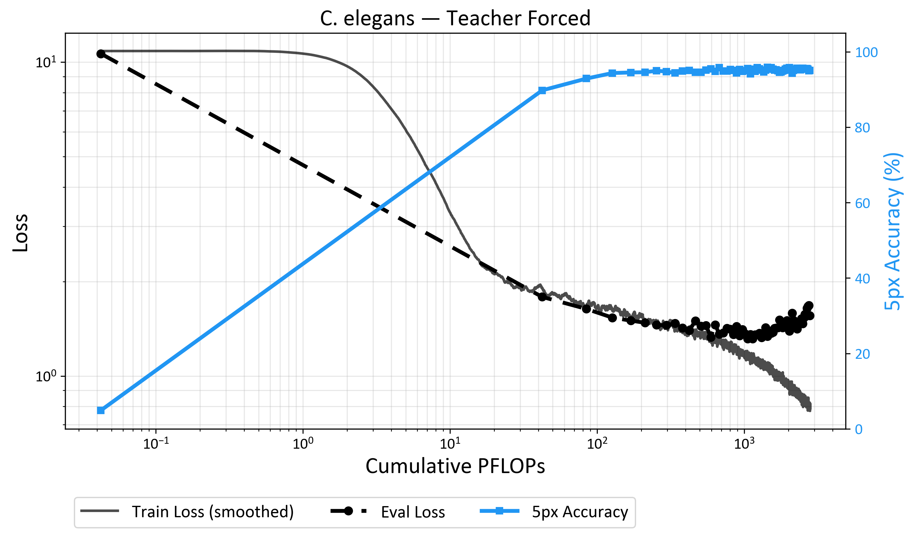 | 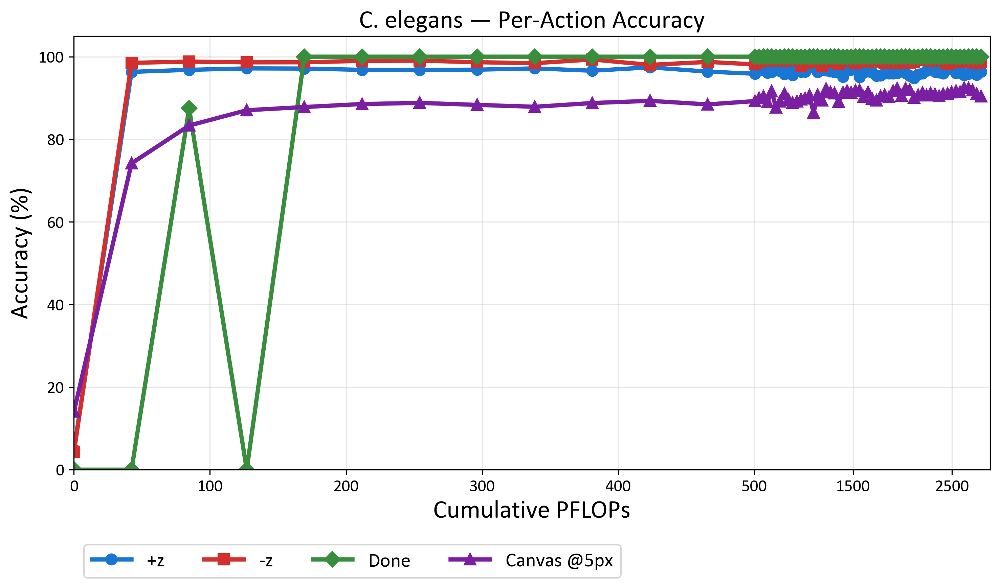 |
| **Figure 2.1.** Training loss and teacher-forced placement accuracy. Overall @5px reaches **95.8%**. | **Figure 2.2.** Per-action accuracy. Button accuracy reaches 98%+ by step 10K; Canvas @5px reaches **92.4%**. |

**Table 2.1.** Teacher-forced evaluation on 13 held-out neurons.

| Metric | Pretrained (step 1) | Best | Final (66K) |
|--------|:-------------------:|:----:|:-----------:|
| Overall @5px | 4.9% | **95.8%** | 95.1% |
| Canvas @5px | 14.1% | **92.4%** | 90.4% |
| Button accuracy | 4.6% | **98.2%** | 97.5% |
| Action validity | 99.4% | **100%** | 100% |

Canvas @5px jumps from 14% to 88% within the first 5K steps, then gradually improves to 92%.

### Autoregressive Evaluation

| | |
|:---:|:---:|
| 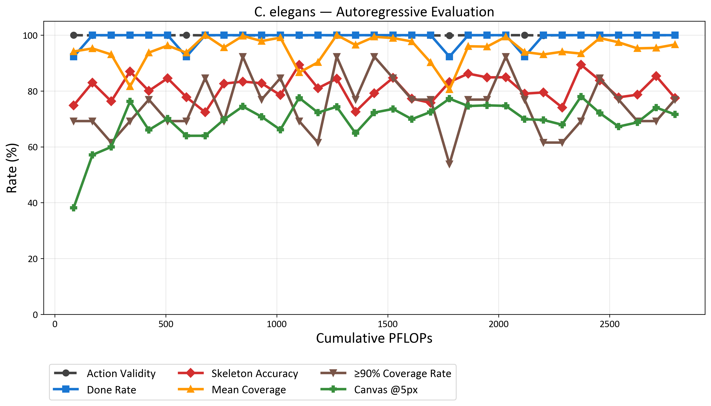 |  |
| **Figure 2.3.** Autoregressive metrics over training. | **Figure 2.4.** Example autoregressive neuron tracking episode on C. elegans data. |

**Table 2.2.** Autoregressive evaluation on 13 held-out neurons.

| Metric | Best |
|--------|:----:|
| Skeleton accuracy | **89.4%** |
| Canvas @5px | **78.0%** |
| Canvas @10px | **83.9%** |
| Done rate | **100%** |
| Mean coverage | 99.7% (step 20K) |
| Coverage >= 90% | 92.3% (step 20K) |
| First node accuracy | **100%** |

The model correctly traces neurons in dense C. elegans neuropil with 89.4% skeleton accuracy and 100% task completion, despite the challenging visual domain.

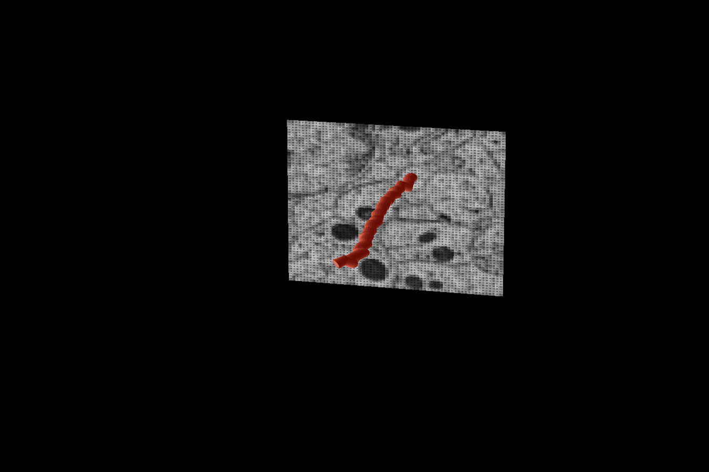

**Figure 2.5.** 3D visualization of a neuron traced by the model in the C. elegans dataset.

---

## 3. Chromosome Tracing

A real annotation task on fungi fluorescence microscopy data with chromosome traces. Only the behavioral component (click ordering, navigation, mistakes) is synthesized. This bridges the synthetic-to-real gap.

**Data**: 28 nuclei, 14 chromosomes each. Train: 23 nuclei × 14 chromosomes × 10 augmentations = 3,220 sequences. Test: 5 held-out nuclei × 14 = 70 sequences.

### Training & Teacher-Forced Evaluation

Fine-tuned from the multitask base checkpoint for 5K steps on the chromosome tracing data.

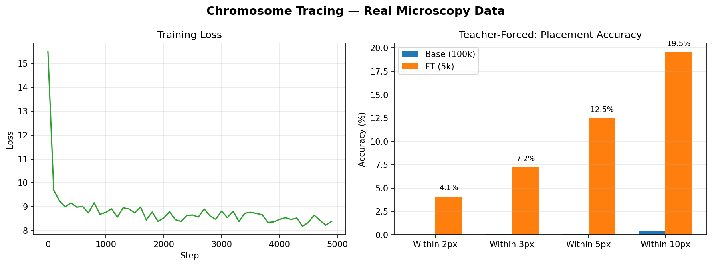

**Figure 3.3.** Training loss and teacher-forced accuracy. Loss drops 47% (15.5 → 8.3).

**Table 3.1.** Teacher-forced placement accuracy (train split).

| Metric | Base (100K) | Fine-tuned (5K) |
|--------|:-----------:|:---------------:|
| @2px | 0.01% | 4.10% |
| @5px | 0.12% | 12.47% |
| @10px | 0.46% | 19.53% |

The base model is at chance on real microscopy (0.12% @5px). Fine-tuning yields 12.5% @5px, lower than synthetic tasks, reflecting the genuine difficulty of dense, noisy biological structures.

### Autoregressive Evaluation

**Table 3.2.** Autoregressive evaluation on 70 held-out test sequences.

| Metric | Base (100K) | Fine-tuned (5K) |
|--------|:-----------:|:---------------:|
| Done rate | 0% (0/70) | 10% (7/70) |
| Avg placed points | 134.0 | 9.1 |
| Avg GT points | 20.1 | 20.1 |
| Avg trace distance (px) | 127.1 | 66.2 |

The base model never terminates and places points randomly. Fine-tuning learns to press Done (10%), produces a reasonable number of points (9.1 vs 20.1 GT), and halves trace distance (127 → 66 px, 48% improvement).

**Figure 3.4.** Example autoregressive chromosome tracing episode.

---

## 4. Human Annotation

Validates that the virtual annotator produces realistic annotation behavior by comparing against real human annotators. Four annotators performed 5 instances each of the colored dot tracking task (20 total annotations) with minimal instructions.

**Note on Annotator 2**: This annotator was excluded from quantitative comparisons because they simply failed the task. They spent 93.8% of actions on navigation (vs 67-78% for others), averaged 392 steps per task (vs 71-118), and their z-placements agreed with other annotators at only 0-12%. This is not a borderline case; the annotator did not understand the task or the interface.

### Action Distribution Comparison

**Table 4.1.** Action distribution: virtual annotator vs. human annotators.

| | Virtual | Ann. 1 | Ann. 3 | Ann. 4 |
|---|:---:|:---:|:---:|:---:|
| Navigation (%) | 73.8 | 78.1 | 70.0 | 66.6 |
| Placement (%) | 14.4 | 15.4 | 21.1 | 22.9 |
| MIP toggle (%) | 10.0 | 4.9 | 6.4 | 8.5 |
| Undo (%) | 1.0 | 0.8 | 1.3 | 0.6 |
| Nav/placement ratio | 5.1 | 5.3 | 3.8 | 2.9 |
| Avg total steps | 118 | 111 | 88 | 71 |

The virtual annotator's action fractions fall within the range of human annotators. The navigation-to-placement ratio (5.1) sits between Annotator 1 (5.3, more cautious) and Annotators 3-4 (2.9-3.8, more efficient).

### Mistake-then-Correction Rate

**Table 4.2.** Correction rate: fraction of placements immediately undone and corrected.

| | Virtual | Ann. 1 | Ann. 3 | Ann. 4 |
|---|:---:|:---:|:---:|:---:|
| Correction rate (%) | 6.6 | 4.6 | 7.6 | 2.4 |

The virtual annotator's correction rate (6.6%) falls within the human range (2.4-7.6%).

### Model vs. Human Performance

The trained model (autoregressive, 100 episodes) is compared against human annotators on the same task.

| | Model | Ann. 1 | Ann. 3 | Ann. 4 |
|---|:---:|:---:|:---:|:---:|
| Task completion (%) | 97 | 100 | 80 | 100 |
| Avg navigation steps | 88 | 87 | 63 | 47 |
| Avg placements | 15.6 | 16.6 | 17.0 | 16.2 |
| Avg MIP toggles | 5.4 | 5.2 | 5.2 | 6.0 |
| Avg undos | 0.1 | 0.8 | 1.4 | 0.4 |
| Avg total steps | 110 | 111 | 88 | 71 |
| Correction rate (%) | 0.8 | 4.6 | 7.6 | 2.4 |

The model's behavior closely matches Annotator 1: nearly identical navigation (88 vs 87), placement count (15.6 vs 16.6), and total steps (110 vs 111). The model achieves 97% task completion while making fewer corrections than any human annotator.

### Example Episodes

| | | | |
|:---:|:---:|:---:|:---:|
| 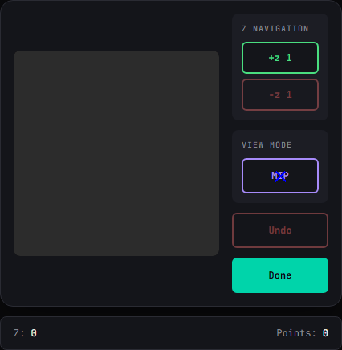 |  | 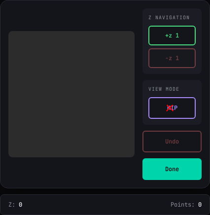 | 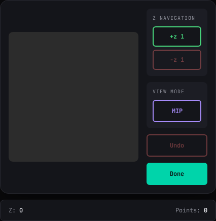 |
| **Figure 4.1.** Annotator 1 (cautious, 111 steps) | **Figure 4.2.** Annotator 4 (efficient, 71 steps) | **Figure 4.3.** Trained model (110 steps) | **Figure 4.4.** Synthetic virtual annotator (ground truth) |

### Human Reaction Times

**Table 4.3.** Median inter-action intervals across 3 competent annotators.

| Action type | N | Median (ms) |
|---|:---:|:---:|
| +z (navigate forward) | 527 | 516 |
| -z (navigate backward) | 461 | 616 |
| Place marker | 249 | 1289 |
| MIP toggle | 68 | 1118 |
| Done | 15 | 1950 |

Annotators take 2.2x longer before canvas placements (1289 ms) than before button presses (598 ms), reflecting the differing precision demands between discrete navigation and spatial targeting.

Human annotators exhibit a spectrum of strategies from cautious (Ann. 1: 5.3 nav/placement, 111 steps) to efficient (Ann. 4: 2.9, 71 steps). Both the virtual annotator and the trained model sit naturally within this spectrum.

---

## 5. UI Adaptation

Tests whether the model memorizes pixel positions tied to a specific GUI layout or learns generalizable annotation behavior. The pretrained model is fine-tuned on 8 diverse UI layout variants of the colored dot tracking task, then evaluated on those 8 in-distribution (ID) variants plus 3 held-out out-of-distribution (OOD) variants that combine visual axes in novel ways.

**Visual axes varied**: panel position (left/right/top/bottom/split), theme (dark/light/retro), button style (rounded/pill/square), button size, canvas border, status position.

### UI Variant Previews

| | | |
|:---:|:---:|:---:|
| 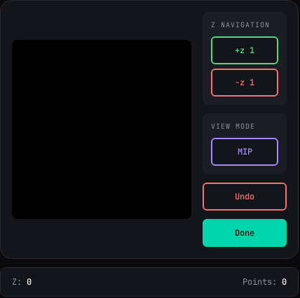 | 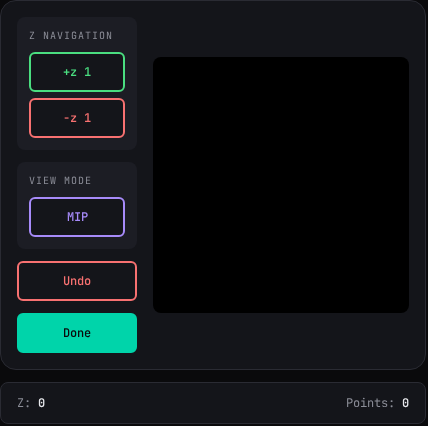 | 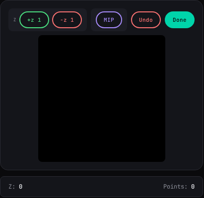 |
| Original | Left panel | Top toolbar |
| 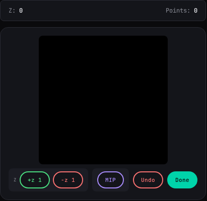 | 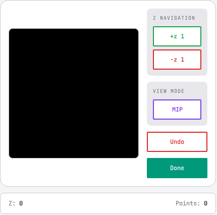 | 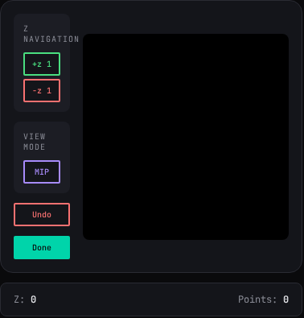 |
| Bottom toolbar | Light right | Minimal left |
| 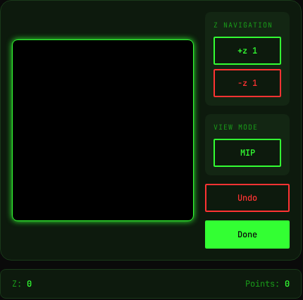 | 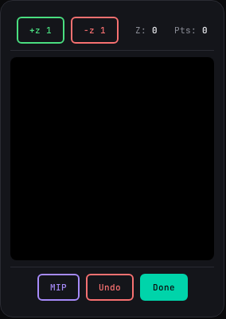 | |
| Retro | Split | |

**OOD variants** (never seen during fine-tuning):

| | | |
|:---:|:---:|:---:|
| 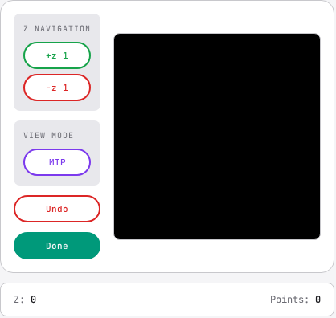 | 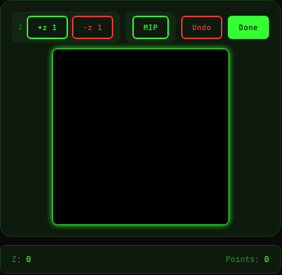 | 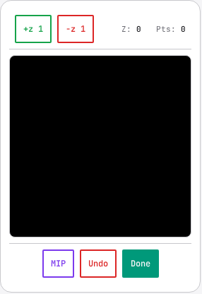 |
| OOD: Light left | OOD: Retro top | OOD: Light split |

### Training

Fine-tuned for 5K steps on 8 ID variants × 500 sequences = 4,000 sequences (~599K frames).

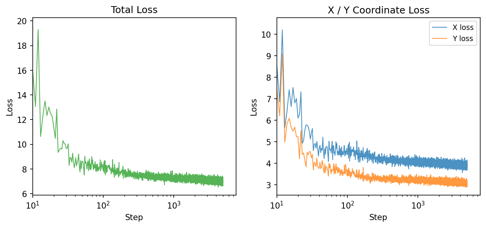

**Figure 5.1.** Training loss curve over 5K steps.

### Teacher-Forced Evaluation

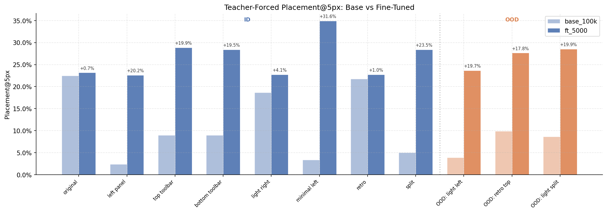

**Figure 5.2.** Teacher-forced placement accuracy @5px across all 11 variants, grouped by base vs fine-tuned.

**Table 5.1.** Teacher-forced placement accuracy @5px per variant.

| Variant | Split | Base @5px | FT @5px | Δ |
|---------|:-----:|:---------:|:-------:|:---:|
| original | ID | 22.4% | **23.2%** | +0.8 |
| retro | ID | 21.7% | **22.8%** | +1.1 |
| light_right | ID | 18.6% | **22.7%** | +4.1 |
| top_toolbar | ID | 9.0% | **28.9%** | +19.9 |
| bottom_toolbar | ID | 8.9% | **28.4%** | +19.5 |
| split | ID | 5.0% | **28.4%** | +23.4 |
| minimal_left | ID | 3.3% | **34.9%** | +31.6 |
| left_panel | ID | 2.4% | **22.6%** | +20.2 |
| ood_retro_top | OOD | 9.9% | **27.7%** | +17.8 |
| ood_light_split | OOD | 8.6% | **28.5%** | +19.9 |
| ood_light_left | OOD | 3.9% | **23.6%** | +19.7 |

**Table 5.2.** Summary by split.

| | Base @5px (avg) | FT @5px (avg) |
|--|:---------------:|:-------------:|
| **ID (8 variants)** | 11.4% | 26.5% |
| **OOD (3 variants)** | 7.5% | 26.6% |

The base model's accuracy correlates with visual similarity to the original layout (22% on original, 2–9% on rearranged layouts). Fine-tuning brings all variants to 22–35%, including OOD variants never seen during training (avg 26.6%), confirming the model learns UI-invariant behavior. Performance on the original layout is preserved (22.4% → 23.2%).

### Autoregressive Evaluation

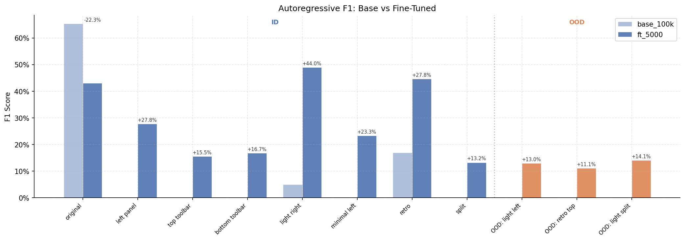

**Figure 5.3.** Autoregressive F1 scores across all 11 variants.

**Table 5.3.** Autoregressive evaluation (20 samples/variant, max 300 steps).

| Variant | Split | Base F1 | FT F1 |
|---------|:-----:|:-------:|:-----:|
| original | ID | **0.654** | 0.430 |
| retro | ID | 0.168 | **0.446** |
| light_right | ID | 0.050 | **0.490** |
| left_panel | ID | 0.000 | **0.278** |
| top_toolbar | ID | 0.000 | **0.155** |
| bottom_toolbar | ID | 0.000 | **0.167** |
| minimal_left | ID | 0.000 | **0.233** |
| split | ID | 0.000 | **0.133** |
| ood_light_left | OOD | 0.000 | **0.130** |
| ood_retro_top | OOD | 0.000 | **0.111** |
| ood_light_split | OOD | 0.000 | **0.141** |

The base model only functions on the original layout (F1=0.654) and partially on retro (0.168); all other layouts yield F1=0. Fine-tuning enables nonzero F1 on all 11 variants, including the 3 OOD layouts.

---

## 6. VLM Baseline

Comparison of the BC model (95M params, step 100K) against two frontier VLMs: **Gemini 3 Flash Preview** and **Qwen3-VL-32B-Instruct** (via OpenRouter). Evaluated on all 9 synthetic tasks.

### Teacher-Forced: Action Accuracy

64 samples/task, ground-truth screenshots, no compounding errors.

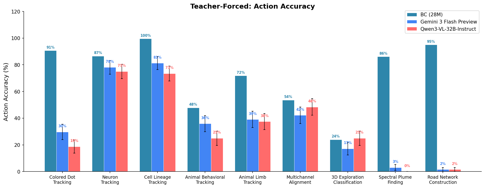

**Figure 6.1.** Teacher-forced action accuracy across 9 tasks.

**Table 6.1.** Teacher-forced action accuracy (± bootstrap SE, n=64).

| Task | Gemini | Qwen |
|------|:------:|:----:|
| cell_lineage_tracking | 81.2% ±4.9 | 73.4% ±5.6 |
| neuron_tracking | 78.1% ±5.1 | 75.0% ±5.4 |
| multichannel_image_alignment | 42.2% ±6.1 | 48.4% ±6.3 |
| animal_limb_tracking | 39.1% ±6.1 | 37.5% ±6.0 |
| animal_behavioral_tracking | 35.9% ±6.0 | 25.0% ±5.4 |
| colored_dot_tracking | 29.7% ±5.7 | 18.8% ±4.9 |
| 3d_exploration_classification | 17.2% ±4.7 | 25.0% ±5.4 |
| spectral_plume_finding | 3.1% ±2.2 | 0.0% |
| road_network_construction | 1.6% ±1.5 | 1.6% ±1.6 |

### Teacher-Forced: Placement Accuracy @5px

Tasks with canvas placement actions only. BC (95M, step 100K) included for comparison.

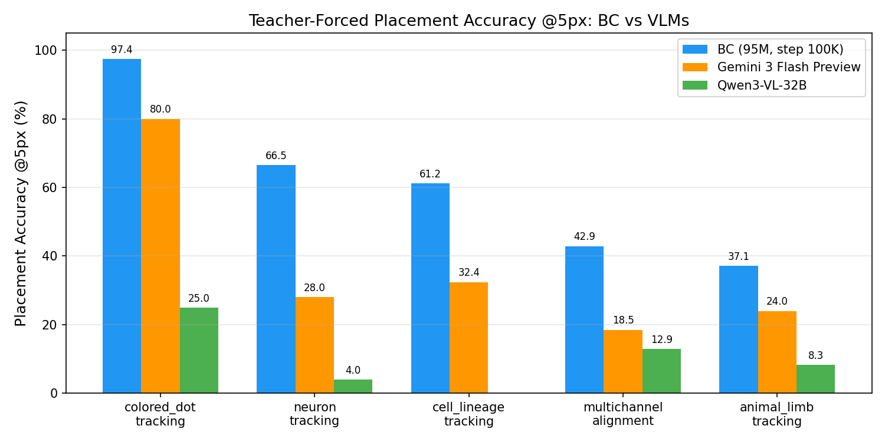

**Figure 6.2.** Teacher-forced placement accuracy @5px: BC vs Gemini vs Qwen.

**Table 6.2.** Teacher-forced placement accuracy @5px.

| Task | BC | Gemini | Qwen |
|------|:--:|:------:|:----:|
| colored_dot_tracking | **97.4%** | 80.0% | 25.0% |
| neuron_tracking | **66.5%** | 28.0% | 4.0% |
| cell_lineage_tracking | **61.2%** | 32.4% | 0.0% |
| multichannel_image_alignment | **42.9%** | 18.5% | 12.9% |
| animal_limb_tracking | **37.1%** | 24.0% | 8.3% |

BC outperforms both VLMs on placement accuracy across all 5 tasks, despite being orders of magnitude smaller.

### Autoregressive: Success Rate

32 instances/task, closed-loop with scaffold (text state + 3 screenshots).

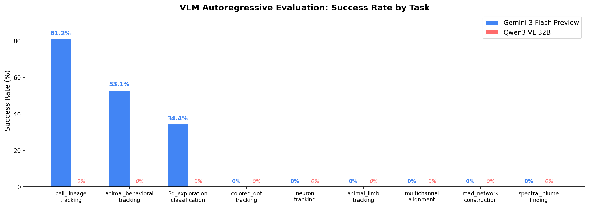

**Figure 6.3.** Autoregressive success rate across 9 tasks.

**Table 6.3.** Autoregressive success rate (32 instances/task).

| Task | Gemini | Qwen |
|------|:------:|:----:|
| cell_lineage_tracking | **81.2%** | 0% |
| animal_behavioral_tracking | **53.1%** | 0% |
| 3d_exploration_classification | **34.4%** | 0% |
| colored_dot_tracking | 0% | 0% |
| neuron_tracking | 0% | 0% |
| animal_limb_tracking | 0% | 0% |
| multichannel_image_alignment | 0% | 0% |
| road_network_construction | 0% | 0% |
| spectral_plume_finding | 0% | 0% |

Autoregressive success rates are very low overall, which is expected: these are long-horizon tasks (50-600 steps) where errors compound quickly in closed-loop evaluation. Gemini achieves nonzero success on only 3/9 tasks. Qwen achieves 0% on all 9 tasks (stuck in repetition loops and API failures).

---

## 7. DAgger

Tests whether DAgger (interactive imitation learning) can improve autoregressive performance on the two tasks where BC achieves 0% accuracy: **animal_behavioral_tracking** and **animal_limb_tracking**.

**Method**: β-DAgger (β=0.1). 50 instances/task collected with 90% model policy, 10% oracle corrections. State-aware greedy oracles provide ground-truth actions. DAgger data (upsampled 50×) mixed with original training data (~26% of training mix). Fine-tuned for 5K steps.

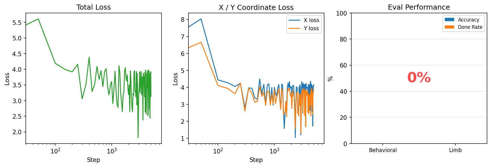

**Figure 7.1.** DAgger results: loss curves and autoregressive evaluation for both tasks.

**Table 7.1.** Autoregressive evaluation (30 samples/task, max 500 steps).

| Task | Condition | Accuracy | Done Rate | Avg Steps |
|------|:---------:|:--------:|:---------:|:---------:|
| animal_behavioral_tracking | Baseline | 0% | 1.3% | 494 |
| animal_behavioral_tracking | DAgger | 0% | 0% | 500 |
| animal_limb_tracking | Baseline | 0% | 0% | 491 |
| animal_limb_tracking | DAgger | 0% | 0% | 492 |

DAgger does not improve performance, both tasks remain at 0% accuracy and 0% done rate. All 60 evaluation instances hit the max step limit with zero markers placed. This confirms that failure on these tasks reflects fundamental task difficulty (complex hierarchical annotation workflows), not compounding errors from distribution shift.

---

## Appendix: Literature Analysis

We conducted independent deep research queries to verify the novelty of our approach (synthetic GUI annotation environments + scientific data domains + behavioral cloning from annotation traces). Both analyses confirmed that no existing work combines these three components. The closest prior work (PseudoClick, Liu et al. 2022; RLCorrector, Nguyen et al. 2022) differs fundamentally in scope and methodology. Full reports are available in `assets/literature_deep_research/`.
